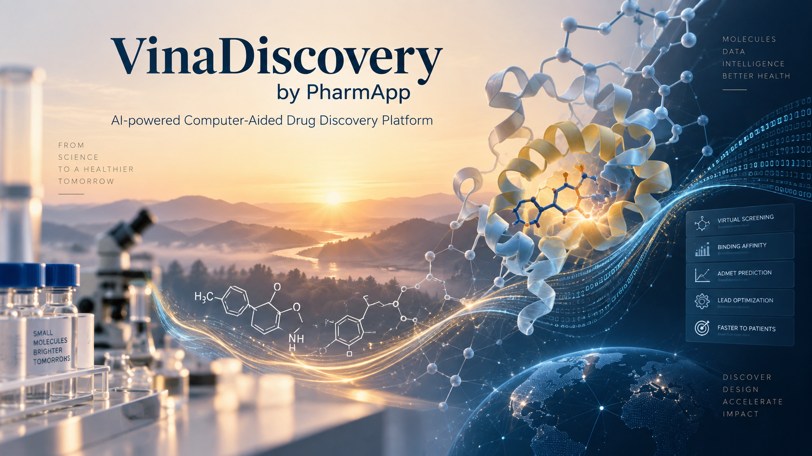
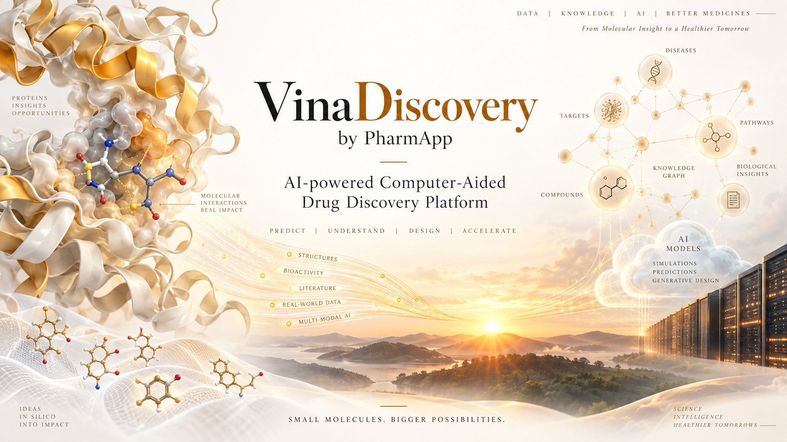
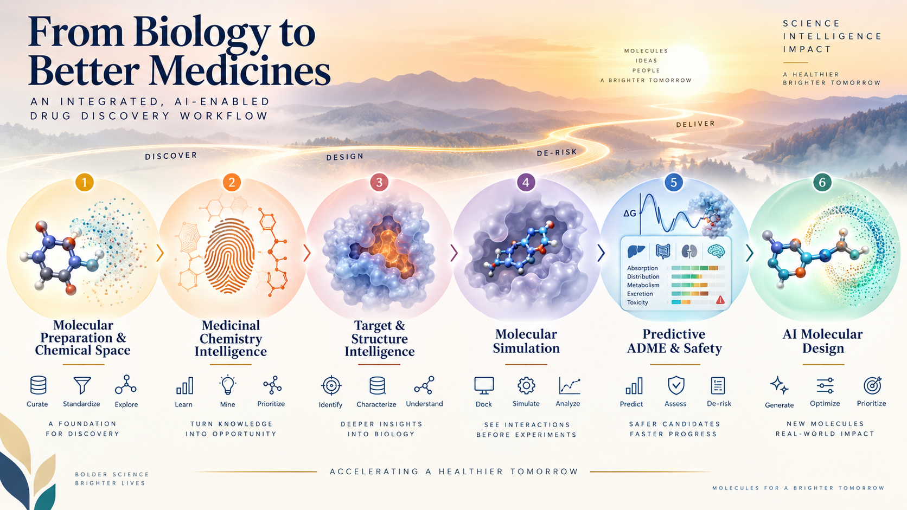
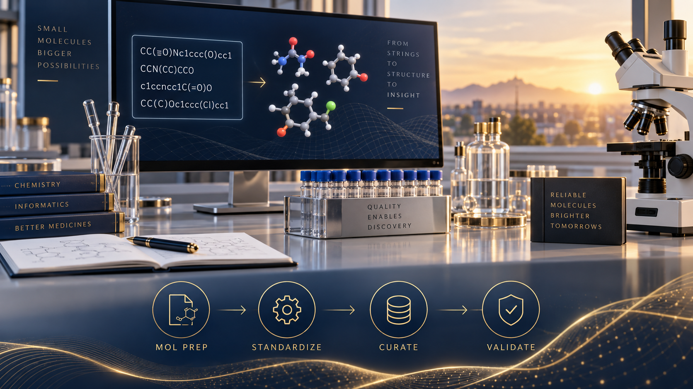
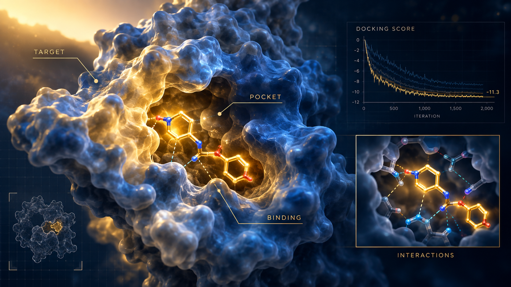
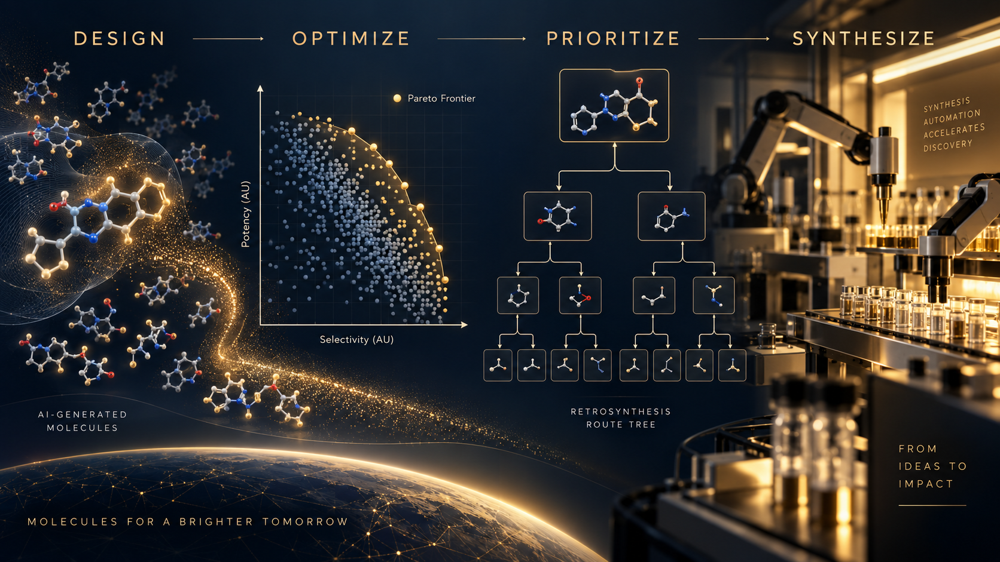

# VinaDiscovery

## AI-Powered Computer-Aided Drug Discovery Platform

<p align="center">
  
</p>

<p align="center">
  <strong>Discover. Predict. Design. Prioritize.</strong>
</p>

<p align="center">
  <em>From Molecular Data to Drug Discovery Decisions.</em>
</p>

<p align="center">
  AI · Cheminformatics · Structural Biology · Molecular Simulation · ADME · Safety · Molecular Design
</p>

---

## Overview

VinaDiscovery is an integrated scientific computing platform for modern drug discovery, combining **cheminformatics, artificial intelligence, structural biology, molecular simulation, ADME, safety intelligence, medicinal chemistry, and synthesis planning** in a unified research environment.

The platform is designed to move beyond isolated molecular calculators toward a connected discovery workflow where **molecules, models, simulations, evidence, uncertainty, and project context** can be linked and traced throughout the research process.

> **From Molecular Data to Drug Discovery Decisions**

<p align="center">
  
</p>

---

# Why VinaDiscovery?

Modern drug discovery requires many different computational perspectives.

A promising molecule is not defined by a single score. Researchers may need to evaluate:

* molecular identity and chemical representation
* chemical similarity and chemical space
* biological targets
* binding sites and molecular interactions
* docking and binding hypotheses
* molecular dynamics
* free-energy calculations
* physicochemical properties
* ADME and developability
* toxicity and safety
* potency and selectivity
* molecular optimization
* synthetic feasibility

VinaDiscovery connects these capabilities into a continuous scientific workflow.

```text
Molecular Data
      │
      ▼
Molecular Preparation
      │
      ▼
Chemical Space & Similarity
      │
      ▼
Target Intelligence
      │
      ▼
Binding Site Intelligence
      │
      ▼
Molecular Binding
      │
      ▼
Interaction Analysis
      │
      ▼
Molecular Simulation
      │
      ▼
Free-Energy Analysis
      │
      ▼
ADME & Safety
      │
      ▼
Lead Optimization
      │
      ▼
Molecular Design
      │
      ▼
Synthesis Planning
```

<p align="center">
  
</p>

---

# Scientific Architecture

VinaDiscovery is organized into six major scientific layers.

<p align="center">
  
</p>

```text
VinaDiscovery
│
├── Molecular Preparation & Chemical Space
│   ├── VinaMolPrep
│   ├── VinaSimilarity
│   └── VinaChemSpace
│
├── Medicinal Chemistry Intelligence
│   ├── VinaMMP
│   ├── VinaBioisostere
│   └── VinaPharmacophore
│
├── Target & Structural Intelligence
│   ├── VinaTarget
│   ├── VinaPocket
│   ├── VinaBind
│   └── VinaInteract
│
├── Molecular Simulation & Physics
│   ├── VinaParam
│   ├── VinaMD
│   └── VinaFEP
│
├── Predictive ADME & Safety Intelligence
│   ├── VinaQSAR
│   ├── VinaADME
│   └── VinaTox
│
└── AI Molecular Design
    ├── VinaLeadOpt
    ├── VinaDeNovo
    ├── VinaSynthesis
    └── VinaSidechain
```

The architecture is intentionally modular while maintaining interoperability between scientific components.

---

# Scientific Layers

## 1. Molecular Preparation & Chemical Space

### VinaMolPrep

VinaMolPrep is the entry point for molecular computation.

Typical preparation steps include:

* structure validation
* normalization
* salt and fragment handling
* tautomer handling
* protonation-state assignment
* stereochemistry validation
* 3D conformer generation
* molecular representation
* charge preparation

The goal is to establish a consistent molecular identity that can be reused across downstream workflows.

<p align="center">
  
</p>

---

### VinaSimilarity

VinaSimilarity answers:

> **Which molecules are most similar to this query?**

Potential applications include:

* nearest-neighbor search
* analog identification
* virtual screening
* scaffold exploration
* similarity-based filtering
* chemical library exploration

Multiple molecular representations can be used rather than relying on a single representation.

---

### VinaChemSpace

VinaChemSpace answers a broader question:

> **How is a large molecular collection organized?**

Potential capabilities include:

* clustering
* diversity analysis
* scaffold distribution
* nearest-neighbor networks
* activity landscapes
* property distributions
* dimensionality reduction
* chemical-space visualization

```text
VinaSimilarity
      =
Query & Search

VinaChemSpace
      =
Population-Level Chemical Intelligence
```

---

# 2. Medicinal Chemistry Intelligence

## VinaMMP

VinaMMP focuses on **matched molecular pair transformations**.

```text
Compound A
     │
     └── structural transformation ──► Compound B
                                      │
                                      ▼
                              Property / Activity Δ
```

Potential signals include:

* ΔpIC50
* ΔKi
* ΔKd
* ΔlogP
* ΔlogD
* Δsolubility
* Δpermeability
* Δclearance

This enables transformation-level knowledge to support medicinal chemistry.

---

## VinaBioisostere

VinaBioisostere builds on molecular transformation evidence to explore alternative structural replacements.

Potential output can include:

```text
Replacement
Activity Evidence
Property Effect
ADME Effect
Target Context
Frequency
Confidence
```

The objective is to support medicinal chemists when exploring structural alternatives during lead optimization.

---

## VinaPharmacophore

VinaPharmacophore models molecular features such as:

* hydrogen-bond donors
* hydrogen-bond acceptors
* hydrophobic regions
* aromatic features
* ionizable features
* spatial constraints

This supports:

* ligand-based screening
* structure-based design
* scaffold exploration
* pharmacophore-driven virtual screening

---

# 3. Target & Structural Intelligence

<p align="center">
  
</p>

## VinaTarget

VinaTarget provides target hypotheses from chemical and biological evidence.

Potential evidence layers include:

```text
Chemical Similarity
        +
Bioactivity Data
        +
Molecular Embeddings
        +
Protein Representations
        +
Knowledge Graph Evidence
        +
Structural Evidence
```

The objective is to provide ranked hypotheses together with supporting evidence and confidence rather than presenting a computational prediction as confirmed biological mechanism.

---

## VinaPocket

VinaPocket focuses on:

> **Where could molecular binding occur?**

Potential outputs include:

* pocket coordinates
* pocket volume
* residue composition
* physicochemical characteristics
* hotspot hypotheses
* ligandability/druggability indicators
* docking search regions

---

## VinaBind

VinaBind focuses on:

> **How could a ligand bind?**

The platform layer is designed to remain **engine-neutral**, allowing different docking and scoring backends to be integrated over time.

Typical outputs include:

```text
Binding Poses
Docking Scores
Pose Geometry
Search Metadata
Backend Information
```

A docking score is treated as a computational ranking signal rather than a direct measurement of experimental binding affinity.

---

## VinaInteract

VinaInteract converts molecular structures and trajectories into interpretable interaction information.

Potential interaction classes include:

* hydrogen bonds
* hydrophobic contacts
* ionic interactions
* aromatic interactions
* cation–π interactions
* halogen interactions
* metal coordination
* residue contacts
* interaction fingerprints

The structural workflow becomes:

```text
VinaPocket
    ↓
VinaBind
    ↓
VinaInteract
```

---

# 4. Molecular Simulation & Physics

## VinaParam

VinaParam focuses on **molecular force-field parameterization**.

Potential outputs include:

```text
Atom Types
Partial Charges
Bond Parameters
Angle Parameters
Torsions
Non-Bonded Parameters
Topology
```

Parameterization and simulation are intentionally treated as separate responsibilities.

---

## VinaMD

VinaMD provides molecular dynamics workflows for studying:

* conformational behavior
* molecular stability
* interaction dynamics
* trajectory analysis
* solvent effects
* structural changes

```text
VinaParam
    ↓
Parameterized System
    ↓
VinaMD
    ↓
Trajectory
```

---

## VinaFEP

VinaFEP is intended for higher-level free-energy workflows, including:

* relative binding free energy
* alchemical transformations
* free-energy perturbation
* related free-energy analysis

The scientific distinction is fundamental:

```text
Docking Score
      ≠
Binding Free Energy
      ≠
Experimental Measurement
```

---

# 5. Predictive ADME & Safety Intelligence

<p align="center">
  
</p>

## VinaQSAR

VinaQSAR provides a general framework for molecular property modelling.

Potential model families include:

* molecular descriptors
* molecular fingerprints
* tree-based models
* graph neural networks
* message-passing neural networks
* molecular transformers
* ensemble models

The framework is intended to support:

* scaffold-aware splitting
* cluster splitting
* temporal validation
* external validation
* uncertainty estimation
* applicability-domain analysis
* explainability

---

## VinaADME

VinaADME focuses on early developability assessment.

Potential areas include:

* physicochemical properties
* lipophilicity
* aqueous solubility
* permeability
* intestinal absorption
* CNS/BBB-related properties
* transporter-related endpoints
* metabolic properties
* clearance-related endpoints
* drug-likeness
* medicinal-chemistry alerts

A VinaADME prediction should not be interpreted as an experimental measurement.

Where appropriate, results should provide:

```text
Prediction
Confidence
Uncertainty
Applicability Domain
Model Version
Dataset Version
Evidence
```

---

## VinaTox

VinaTox extends the predictive layer toward safety intelligence.

Potential endpoints can include:

* mutagenicity
* cardiac safety-related endpoints
* liver toxicity
* cytotoxicity
* acute toxicity
* carcinogenicity
* skin sensitization
* endocrine-related endpoints

Safety predictions are intended for early computational triage and hypothesis generation, not as substitutes for experimental toxicology.

---

# 6. AI Molecular Design

<p align="center">
  
</p>

## VinaLeadOpt

VinaLeadOpt is designed for **multi-parameter lead optimization**.

A realistic optimization problem may involve:

```text
Maximize:
    Potency
    Selectivity
    Solubility

Minimize:
    Toxicity
    Metabolic Liability

Constraints:
    Molecular Weight
    Scaffold Retention
    Synthetic Feasibility
    Chemical Novelty
```

Potential capabilities include:

* multi-objective optimization
* Pareto-front analysis
* candidate ranking
* evidence aggregation
* trade-off analysis

---

## VinaDeNovo

VinaDeNovo focuses on generative molecular design.

Candidate structures should be evaluated through downstream computational checks:

```text
Generate
   ↓
VinaMolPrep
   ↓
VinaSimilarity
   ↓
VinaADME / VinaTox
   ↓
VinaTarget / VinaBind
   ↓
VinaSynthesis
   ↓
VinaLeadOpt
```

Generating a molecular structure is therefore only one stage of the discovery process.

---

## VinaSynthesis

VinaSynthesis connects computational molecular design with practical chemistry.

Potential outputs include:

* retrosynthetic routes
* precursor candidates
* building blocks
* alternative routes
* synthetic feasibility evidence

```text
Computationally Designed Molecule
              ↓
       Synthetic Planning
              ↓
       Experimentally Testable
```

---

## VinaSidechain

VinaSidechain extends the platform toward peptide and protein-related molecular engineering.

Potential applications include:

* non-natural amino acids
* sidechain libraries
* rotamer analysis
* peptide design
* protein engineering

---

# End-to-End Discovery Workflow

<p align="center">
  
</p>

A typical small-molecule discovery workflow can connect multiple VinaDiscovery capabilities:

```text
SMILES / SDF
     │
     ▼
VinaMolPrep
     │
     ├──────────────► VinaSimilarity
     │
     ├──────────────► VinaChemSpace
     │
     └──────────────► VinaQSAR
                         │
                         ▼
                    VinaTarget
                         │
                         ▼
                    VinaPocket
                         │
                         ▼
                     VinaBind
                         │
                         ▼
                   VinaInteract
                         │
                         ▼
                      VinaMD
                         │
                         ▼
                     VinaFEP
                         │
                ┌────────┴────────┐
                ▼                 ▼
           VinaADME           VinaTox
                │                 │
                └────────┬────────┘
                         ▼
                    VinaLeadOpt
                         │
                         ▼
                    VinaDeNovo
                         │
                         ▼
                  VinaSynthesis
                         │
                         ▼
                 Experimental
                   Validation
```

---

# Scientific Result Contract

A computational result should be treated as a scientific record rather than an isolated number.

Example:

```json
{
  "value": 0.83,
  "unit": "probability",
  "method": "model",
  "model_version": "1.0.0",
  "dataset_version": "2026.09",
  "input_structure_id": "structure-id",
  "uncertainty": 0.07,
  "applicability_domain": "in-domain",
  "evidence_count": 124,
  "software_versions": {},
  "provenance": {},
  "warnings": []
}
```

The schema may evolve, but the principle is:

> **Every scientific result should be traceable.**

---

# Molecular Knowledge Layer

VinaDiscovery is designed around a shared scientific data model.

Core entities can include:

```text
Compound
Structure Variant
Target
Protein Structure
Assay
Activity
Prediction
Model Version
Simulation
Interaction
Transformation
Evidence
Artifact
Job
```

A computational result should be traceable through:

```text
Input
  ↓
Preparation
  ↓
Dataset
  ↓
Model / Algorithm
  ↓
Parameters
  ↓
Execution
  ↓
Result
  ↓
Evidence
```

This architecture supports:

* reproducibility
* auditability
* collaboration
* experiment tracking
* model lifecycle management
* computational provenance

---

# Uncertainty & Applicability Domain

VinaDiscovery treats uncertainty as part of the scientific result.

A prediction may be accompanied by:

```text
Prediction
   +
Confidence
   +
Uncertainty
   +
Applicability Domain
   +
Evidence
```

This helps researchers distinguish between:

* predictions strongly supported by related training examples
* predictions with limited evidence
* predictions outside the expected applicability domain
* computational hypotheses requiring additional experimental investigation

The goal is not to hide uncertainty, but to make it visible.

---

# Scientific Integrity

VinaDiscovery explicitly distinguishes between different classes of information.

```text
Experimental
Calculated
Predicted
Inferred
Literature-Derived
```

The platform avoids scientifically misleading equivalences such as:

```text
Docking score
    ≠
Experimental affinity

Prediction
    ≠
Experimental measurement

Target hypothesis
    ≠
Confirmed mechanism

Negative toxicity prediction
    ≠
Proof of safety
```

Computational results are intended to support scientific reasoning and prioritization alongside experimental evidence.

---

# Validation Philosophy

Different scientific modules require different validation strategies.

| Module Group                | Example Validation                                                |
| --------------------------- | ----------------------------------------------------------------- |
| Similarity / Chemical Space | neighbour relevance, enrichment, scaffold recovery                |
| Target Prediction           | top-k recall, PR-AUC, temporal/external validation                |
| Molecular Binding           | pose RMSD, enrichment and benchmark evaluation                    |
| Interaction Analysis        | recovery against experimental structures                          |
| Parameterization            | energies/geometries against validated references                  |
| Molecular Dynamics          | trajectory stability and experimental observables where available |
| Free Energy                 | error against experimental ΔG / ΔΔG                               |
| QSAR                        | scaffold, temporal and external validation                        |
| ADME                        | endpoint-specific predictive metrics and calibration              |
| Toxicity                    | sensitivity, specificity, PR-AUC and external evaluation          |
| Molecular Design            | validity, novelty, uniqueness and property success                |
| Synthesis Planning          | route validity, feasibility and expert review                     |

For molecular machine learning, random splitting alone may not adequately evaluate generalization across chemical space. VinaDiscovery therefore targets validation strategies appropriate to the intended use case, including scaffold, cluster, temporal and external evaluation.

---

# Data, AI & Physics

VinaDiscovery is designed around three complementary modes of scientific computing:

```text
Data
 +
AI / ML
 +
Physics-Based Simulation
```

connected by:

```text
Evidence
```

Together:

```text
Data
  +
AI / ML
  +
Physics-Based Simulation
  +
Evidence
  =
Molecular Intelligence
```

<p align="center">
  
</p>

---

# Platform Architecture

VinaDiscovery is designed as an extensible scientific platform rather than a single monolithic computational engine.

```text
Web Application
      │
      ▼
Scientific API
      │
      ▼
Workflow Orchestration
      │
      ├── Cheminformatics
      ├── AI / ML
      ├── Molecular Binding
      ├── Molecular Mechanics
      ├── Molecular Dynamics
      ├── Free Energy
      ├── ADME / Toxicology
      └── Synthesis Planning
      │
      ▼
Scientific Data Layer
      │
      ├── Molecular Data
      ├── Bioactivity
      ├── Models
      ├── Evidence
      ├── Simulations
      └── Artifacts
      │
      ▼
CPU / GPU / HPC / Cloud
```

The architecture is intended to support both interactive research and high-throughput computational campaigns.

---

# Design Principles

## 1. Scientific correctness over marketing claims

Algorithms should be described according to what they actually calculate.

## 2. Evidence-aware AI

Predictions should be accompanied by uncertainty, applicability context and provenance whenever possible.

## 3. Reproducibility by design

Molecular identity, datasets, model versions, parameters and software versions should be traceable.

## 4. Modular scientific architecture

Individual capabilities should remain independently testable while interoperating through shared scientific data contracts.

## 5. Engine-neutral infrastructure

The platform layer should not be unnecessarily tied to a single computational backend.

## 6. Human-led discovery

AI and automation should augment researchers rather than obscure scientific judgement.

## 7. Experimental validation remains essential

Computational predictions generate hypotheses and prioritize experiments; they do not replace experimental evidence.

---

# Intended Users

VinaDiscovery is designed for researchers working in:

* Medicinal Chemistry
* Computational Chemistry
* Structural Biology
* Drug Discovery
* AI / ML for Chemistry
* Pharmaceutical R&D
* Biotechnology
* Academic Research
* Chemical Biology
* Molecular Design

---

# Repository Structure

A suggested repository structure:

```text
VinaDiscovery/
│
├── images/
│   ├── VinaDiscovery_ADME_Tox_Intelligence.png
│   ├── VinaDiscovery_AI_Design_Synthesis.png
│   ├── VinaDiscovery_Binding_Intelligence.png
│   ├── VinaDiscovery_Brochure_Cover.png
│   ├── VinaDiscovery_Molecular_Preparation.png
│   ├── VinaDiscovery_Workflow_Infographic.png
│   ├── a_wide_cinematic_clean_infographic_diagram_scene_batch_1.png
│   ├── a_wide_cinematic_futuristic_infographic_style_il_batch_3.png
│   ├── a_wide_cinematic_high_quality_promotional_banner.png
│   └── wide_cinematic_conceptual_composite_image_of_drug_batch_2.png
│
├── docs/
├── src/
├── tests/
├── examples/
├── benchmarks/
├── models/
├── workflows/
├── README.md
├── LICENSE
└── CONTRIBUTING.md
```

---

# Project Vision

The long-term vision is to build a **unified molecular intelligence environment** where computational chemistry, AI, physics-based simulation, biological evidence and experimental knowledge can work together.

The evolution is expected to progress from:

```text
Individual Models
      ↓
Scientific Modules
      ↓
Integrated Workflows
      ↓
Evidence-Aware Decision Support
      ↓
AI-Assisted Molecular Design
      ↓
Closed-Loop Discovery
```

The objective is not simply to generate more predictions.

It is to help researchers ask better scientific questions:

> **Why this molecule?**
> **Why this target?**
> **Why this binding mode?**
> **What evidence supports it?**
> **How uncertain is the prediction?**
> **What should be tested next?**

---

# Roadmap

## Phase 1 — Molecular Foundation

* [ ] VinaMolPrep
* [ ] Molecular identity and standardization
* [ ] Shared molecular data model
* [ ] VinaSimilarity
* [ ] VinaChemSpace
* [ ] Scientific provenance

## Phase 2 — Discovery Intelligence

* [ ] VinaTarget
* [ ] VinaPocket
* [ ] VinaBind
* [ ] VinaInteract
* [ ] VinaPharmacophore
* [ ] VinaMMP
* [ ] VinaBioisostere

## Phase 3 — Simulation

* [ ] VinaParam
* [ ] VinaMD
* [ ] VinaFEP
* [ ] High-throughput computational workflows

## Phase 4 — Predictive Intelligence

* [ ] VinaQSAR
* [ ] VinaADME
* [ ] VinaTox
* [ ] Applicability-domain analysis
* [ ] Uncertainty estimation
* [ ] Model versioning and validation

## Phase 5 — Molecular Design

* [ ] VinaLeadOpt
* [ ] VinaDeNovo
* [ ] VinaSynthesis
* [ ] VinaSidechain
* [ ] Closed-loop molecular design workflows

---

# Status

> **Research & Development**

VinaDiscovery is an evolving scientific platform.

Individual modules may have different levels of maturity, validation and production readiness.

Scientific claims, model performance and computational capabilities should therefore always be evaluated in the context of the corresponding:

* module
* dataset
* model version
* computational method
* intended use

---

# Disclaimer

VinaDiscovery is intended for **research, computational analysis, hypothesis generation and decision support**.

Computational predictions do not constitute experimental confirmation, clinical evidence, regulatory approval or a substitute for laboratory validation.

Users are responsible for interpreting computational results within their scientific context and validating important findings experimentally.

---

# Contributing

Contributions are welcome across:

* cheminformatics
* molecular modelling
* machine learning
* structural biology
* molecular simulation
* ADME / toxicity modelling
* scientific software engineering
* data infrastructure
* workflow orchestration
* scientific visualization
* validation and benchmarking

Please open an issue or pull request with a clear description of the proposed change, scientific rationale and validation strategy.

---

# VinaDiscovery by PharmApp

<p align="center">
  
</p>

<p align="center">
  <strong>AI-Powered Computer-Aided Drug Discovery Platform</strong>
</p>

<p align="center">
  <strong>Discover. Predict. Design. Prioritize.</strong>
</p>

<p align="center">
  <em>From Molecular Data to Drug Discovery Decisions.</em>
</p>
